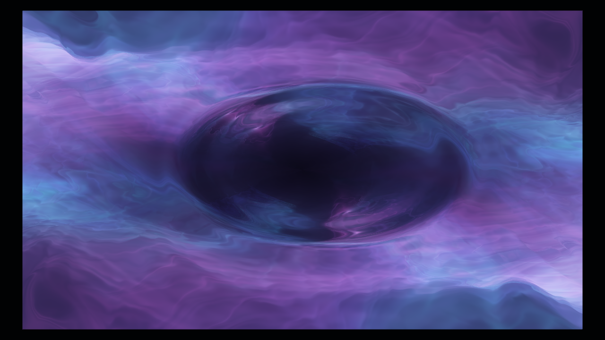

# Fluid Data Visualizer

Interactive Unity/URP shader demo extracted from `SlotBattle`.



## Overview

Fluid Data Visualizer renders a raymarched fluid surface and lets the user click on the mesh to inject a UV-space ripple. The runtime component reads the hit UV from a `MeshCollider`, then drives the shader through a `MaterialPropertyBlock`.

## Contents

- `Assets/FluidDataVisualizer/Scripts/FluidDataVisualizer.cs` - click handling and ripple animation.
- `Assets/FluidDataVisualizer/Shaders/XorFluidRaymarching.shader` - URP HLSL raymarching shader with interactive ripple distortion.
- `Assets/FluidDataVisualizer/Materials/Custom_XorFluidRaymarching.mat` - demo material.
- `Assets/FluidDataVisualizer/Scenes/FluidDataVisualizerDemo.unity` - ready-to-open demo scene.

## Requirements

- Unity `6000.3.13f1`
- Universal Render Pipeline `17.3.0`

## Usage

1. Open this folder in Unity Hub.
2. Open `Assets/FluidDataVisualizer/Scenes/FluidDataVisualizerDemo.unity`.
3. Press Play.
4. Click the fluid surface to trigger expanding ripple distortion.

## Regenerating the Demo

The repository includes `Assets/Editor/FluidDataVisualizerDemoBuilder.cs`. From batch mode, it can rebuild the demo scene and screenshot:

```bash
/Applications/Unity/Hub/Editor/6000.3.13f1/Unity.app/Contents/MacOS/Unity \
  -batchmode \
  -quit \
  -projectPath "$(pwd)" \
  -executeMethod FluidDataVisualizerDemoBuilder.BuildDemo
```
